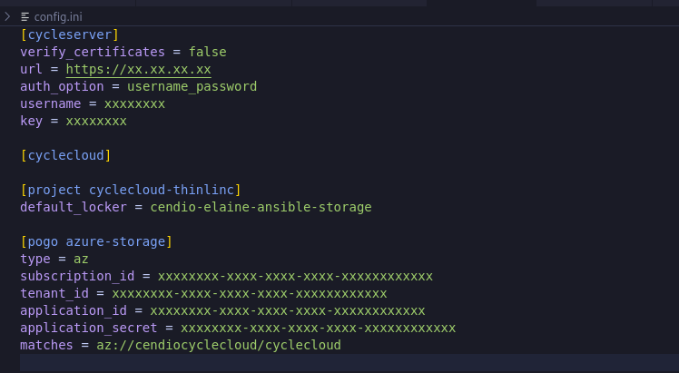
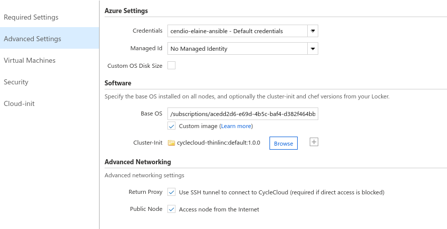

# Thinlinc CycleCloud Project

This project is used for Azure CycleCloud integrated with Thinlinc to allow thinlinc work smoothly on Cyclecloud cluster nodes.

Please reference the [CycleCloud Projects page](https://docs.microsoft.com/en-us/azure/cyclecloud/projects) dives into
greater detail on the concepts and examples.

## Goals

In this lab you will learn how to:

* Use CycleCloud Projects for installing a custom application in a cluster.
* Stage application installation files in the blobs directory of a project.
* Write a script that is executed on each and every cluster node as it boots.
* Stage configuration files into every cluster node.
* Upload a CycleCloud Project into a storage locker.
* Start a new cluster that uses the new project.

## A quick step-to-step guides to use this project

### 1.1 pre-requisites

* have a valid Azure subscription and a service principal ready
* have a valid Azure CycleCloud installed()

### 1.2 Uploading this Thinlinc CycleCloud project into the storage locker

Please note that one of the steps in setting up an Azure CycleCloud installation is the creation of an Azure storage account and an accompanying blob container. This container is the *"Locker"* that the CycleCloud server uses to stage CycleCloud projects for cluster nodes. CycleCloud cluster nodes orchestrated by this CycleCloud server are configured to download CycleCloud projects from this locker as part of the boot-up process of the node.

* To see what locker is set in your cyclecloud, use the `cyclecloud locker list` command:

  ```sh
    (venv) xuan@dhcp-130:~$ cyclecloud locker list
    cendio-elaine-ansible-storage (az://cendiocyclecloud/cyclecloud)
    (venv) xuan@dhcp-130:~$ 
  ```

  In this example, the storage account name is `cendiocyclecloud`, and the blob container name is `cyclecloud`. 

Prepare the credentials to access the blob container associated with the locker: 

* Edit the cyclecloud configuration file `~/.cycle/config.ini`:

  ```sh
    (venv) xuan@dhcp-130:~$ vim ~/.cycle/config.ini
  ```

* Add the section below, with `subscription_id`, `tenant_id`, `application_id`, `application_secret` matching those in the service principal used when setting up your cyclecloud. Also replace the storage account name `cendiocyclecloud` with the output of the `cyclecloud locker list` command:

  ```ini
  [pogo azure-storage]
  type = az
  subscription_id = xxxxxxxx-xxxx-xxxx-xxxx-xxxxxxxxxxxx
  tenant_id = xxxxxxxx-xxxx-xxxx-xxxx-xxxxxxxxxxxx
  application_id = xxxxxxxx-xxxx-xxxx-xxxx-xxxxxxxxxxxx
  application_secret = xxxxxxxx-xxxx-xxxx-xxxx-xxxxxxxxxxxx
  matches = az://cendiocyclecloud/cyclecloud
  ```

  _You can locate your Subscription ID using the Azure CLI (`az` command) to list the accounts:_ `az account list -o table`

* Your `~/.cycle/config.ini` should now look something like this

  

* Upload the project from its directory using the `cyclecloud project upload` command

  ```sh
    (venv) xuan@dhcp-130:~/cyclecloud-thinlinc$ cyclecloud project upload
    Job 3945e310-e3e6-9149-5969-cadfd55cd117 has started
    Log file is located at: /home/xuan/.azcopy/3945e310-e3e6-9149-5969-cadfd55cd117.log
    
    INFO: azcopy: A newer version 10.25.1 is available to download
    
    0 Files Scanned at Source, 0 Files Scanned at Destination
    
    Job 3945e310-e3e6-9149-5969-cadfd55cd117 Summary
    Files Scanned at Source: 5
    Files Scanned at Destination: 0
    Elapsed Time (Minutes): 0.0333
    Number of Copy Transfers for Files: 5
    Number of Copy Transfers for Folder Properties: 0 
    Total Number Of Copy Transfers: 5
    Number of Copy Transfers Completed: 5
    Number of Copy Transfers Failed: 0
    Number of Deletions at Destination: 0
    Total Number of Bytes Transferred: 1738
    Total Number of Bytes Enumerated: 1738
    Final Job Status: Completed
    
    
    Upload complete!
    (venv) xuan@dhcp-130:~/cyclecloud-thinlinc$
  ```

### 1.3 Create a new Cluster with the Thinlinc Project

Having uploaded the Thinlinc project into the CycleCloud locker, you can now create a new cluster in CycleCloud and specify that each node should use the `cyclecloud-thinlinc:default` spec. 

* From the Cluster page of your Azure CycleCloud web portal, navigate to the *Advanced Settings* section. Under the *Software* section, click on the "Browse" button which will open a file selector dialog, You will see a folder named `cyclecloud-thinlinc/`. Open it by double-clicking it. Then open the `1.0.0/` folder. Finally, select the `default/` folder by clicking on it once and pressing the "Select" button on the bottom of the dialog window. After pressing "Select" the file selector dialog will close. This selects the `default` spec of version `1.0.0` of the project `cyclecloud-thinlinc`.
  

* Save the cluster and start it. When the master node turns green, log into it and verify that Thinlinc web interface configured correctly.
